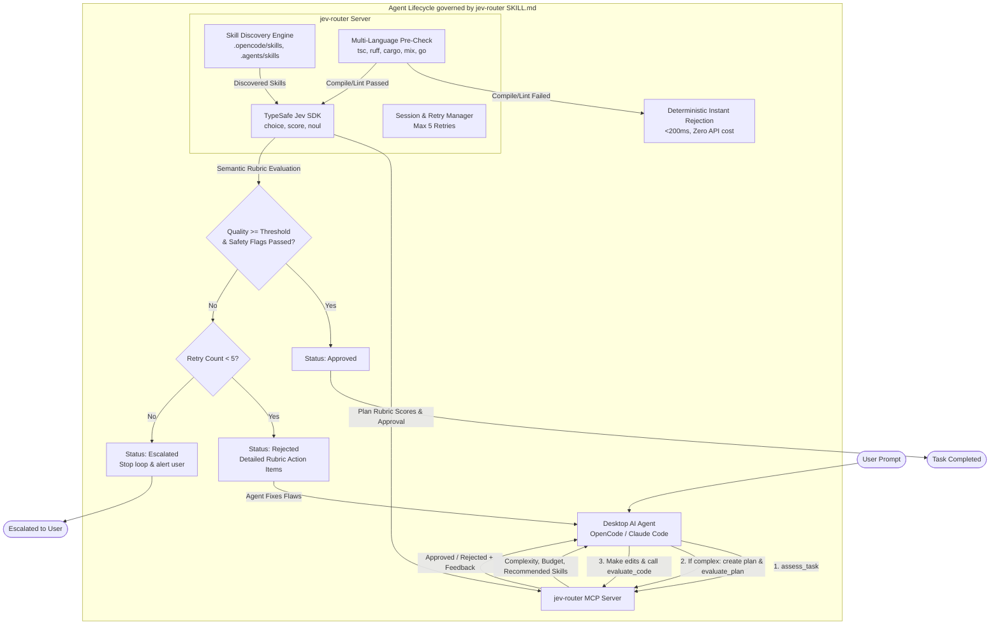

# Jev-Router: Architecture, Specification & Implementation Plan

> **High-speed MCP routing, gating, and skills-orchestration server powered by Jev AI (TypeSafe AI) System One primitives.**

---

## 1. Executive Summary & Vision

Modern desktop AI coding agents (such as **OpenCode**, **Claude Code**, and **Cursor**) possess deep generative capabilities, but frequently suffer from inefficiencies:
- **Over-reasoning on trivial tasks** (e.g., burning full-budget thinking tokens on simple syntax/typo fixes).
- **Under-planning on complex architectural tasks** (e.g., prematurely editing code before validating requirements, dependencies, and migration risks).
- **Silent quality regressions** (e.g., introducing missing null checks, security vulnerabilities, or broken edge cases).
- **Skill blindness** (e.g., having specialized domain skills installed in `.opencode/skills/` or `.agents/skills/`, but forgetting to invoke them when relevant).

**jev-router** solves this by acting as a fast, autonomous **"System One" supervisor and quality gate** connected via the **Model Context Protocol (MCP)**. Powered by **Jev AI (`@typesafe-ai/sdk`)**, `jev-router` executes non-autoregressive, sub-second evaluations (70–500ms) to:
1. **Assess and route tasks**: Determine task complexity, prescribe reasoning effort, suggest entry files, and map installed skills before any code is modified.
2. **Evaluate implementation plans**: Audit proposed plans against structured rubrics before agents start editing.
3. **Gate code changes**: Run deterministic multi-language compilation/lint checks, followed by semantic rubric scoring with an automated retry and escalation loop (max 5 retries).
4. **Enforce protocol via Agent Skills**: Expose a standard `SKILL.md` that instructs the desktop agent on how and when to consult `jev-router`.

---

## 2. System Architecture



---

## 3. The Jev AI ("System One") Advantage

Unlike conversational LLMs that generate free-form text token by token (taking 3–20+ seconds), **Jev AI** is a non-autoregressive decision model built for high-speed, programmatic judgments:

| Capability | Conversational LLMs (Claude/GPT) | Jev AI (`@typesafe-ai/sdk`) |
| :--- | :--- | :--- |
| **Response Latency** | 3,000ms – 25,000ms | **70ms – 500ms** |
| **Output Format** | Unstructured markdown / loose JSON | **Strict primitives (`choice`, `score`, `noul`)** |
| **Hallucination Risk** | Non-zero | **Zero (constrained decision space)** |
| **Cost Profile** | High input/output token cost | **Fractional / micro-decision pricing** |
| **Confidence Scoring** | Inherent calibration drift | **RLCD calibrated probability distributions** |

### Jev SDK Primitives Used:
- **`choice(prompt, options)`**: Classifies inputs into discrete categories (e.g., complexity tier, primary skill, reasoning level).
- **`score(prompt, scale)`**: Places items on a continuous ordered scale (e.g., code quality from 1.0 to 5.0).
- **`noul(prompt)`**: Evaluates binary conditions probabilistically (e.g., `is_null_safe`, `has_security_vulnerabilities`, `aligns_with_intent`).

---

## 4. MCP Tools Specification

The server exposes 4 dedicated tools over standard input/output (`stdio` JSON-RPC).

### Tool 1: `assess_task`
Evaluates the incoming user request before the agent touches files or writes code.

- **Input Schema (Zod):**
  ```typescript
  {
    task_description: z.string().describe("The user's original task request"),
    context_files: z.array(z.string()).optional().describe("Files currently opened or mentioned"),
    working_directory: z.string().optional().describe("Root path of the repository")
  }
  ```
- **Execution Flow:**
  1. Calls `SkillScanner` to inspect available local (`.opencode/skills`, `.agents/skills`) and global skills.
  2. Submits state to Jev AI in a single parallel call:
     - `complexity`: `choice` (`trivial_fix`, `localized_logic`, `refactoring`, `architectural_change`, `migration`)
     - `reasoning_budget`: `choice` (`low`, `medium`, `high`, `deep`)
     - `requires_plan`: `noul` ("Does this task require an architectural plan before modifying code?")
     - For each discovered skill: `noul` ("Is skill '{skill_name}' relevant and useful for this task?")
  3. Suggests recommended files or directories to inspect first.
- **Output Schema:**
  ```json
  {
    "complexity": "architectural_change",
    "reasoning_budget": "high",
    "requires_plan": true,
    "recommended_skills": [
      { "name": "database-migration", "reason": "Task involves schema changes" }
    ],
    "suggested_starting_files": ["src/db/schema.prisma"],
    "guidance": "Create an implementation plan and validate it with evaluate_plan before writing code."
  }
  ```

---

### Tool 2: `evaluate_plan`
Evaluates an agent's proposed implementation plan before code modifications begin.

- **Input Schema (Zod):**
  ```typescript
  {
    task_description: z.string().describe("The original task intent"),
    plan_markdown: z.string().describe("The complete markdown plan created by the agent"),
    affected_files: z.array(z.string()).optional().describe("List of files intended to be changed")
  }
  ```
- **Jev Evaluation Rubric:**
  - `clarity_score`: `score` (1 to 5) — Is the plan unambiguous and actionable?
  - `scope_complete`: `noul` — Does the plan cover all requirements without omitting steps?
  - `risk_addressed`: `noul` — Are edge cases, backwards compatibility, and failure modes covered?
  - `clean_verification`: `noul` — Does the plan outline clear automated or manual verification?
- **Output Schema:**
  ```json
  {
    "status": "approved" | "rejected",
    "scores": {
      "clarity": 4.5,
      "scope_complete": 0.96,
      "risk_addressed": 0.88,
      "clean_verification": 0.92
    },
    "rejection_reasons": [],
    "required_improvements": []
  }
  ```

---

### Tool 3: `evaluate_code`
Performs multi-layer verification on code diffs before the agent presents work to the user.

- **Input Schema (Zod):**
  ```typescript
  {
    task_intent: z.string().describe("What the changes were intended to accomplish"),
    diff: z.string().describe("Unified git diff or changed code block"),
    working_directory: z.string().optional().describe("Root directory for running pre-checks"),
    session_id: z.string().optional().describe("Unique identifier to track retry attempts")
  }
  ```
- **Execution Flow:**
  1. **Phase A: Deterministic Multi-Language Pre-Gate (<200ms)**
     - Auto-detects project language / build tool.
     - Runs lint/typecheck command (e.g. `npm run lint`, `tsc --noEmit`, `cargo check`, `ruff check`).
     - If compilation/lint fails: **Instantly rejects** with the compiler stderr output, saving Jev API calls.
  2. **Phase B: Semantic Jev Rubric Evaluation**
     - Runs parallel Jev primitives:
       - `null_safety`: `noul` ("Are null/undefined states, empty arrays, and optional values safely handled?")
       - `security_integrity`: `noul` ("Is the code free of injection, secrets, or insecure practices?")
       - `intent_alignment`: `noul` ("Does the diff strictly address the intended task without regressions?")
       - `overall_quality`: `score` (1 to 5) — Overall maintainability, elegance, and adherence to idioms.
  3. **Phase C: Quality Gating & Retry Manager**
     - Checks if `overall_quality >= 3.8` (configurable) and all `noul` flags exceed confidence threshold (`>= 0.80`).
     - If passing: resets session retry counter and returns `status: "approved"`.
     - If failing: increments retry counter.
       - If `retry_count < 5`: returns `status: "rejected"` with detailed action items for the agent to fix.
       - If `retry_count >= 5`: returns `status: "escalated"` with instructions to halt the loop and request user intervention.
- **Output Schema:**
  ```json
  {
    "status": "approved" | "rejected" | "escalated",
    "attempt": 2,
    "max_retries": 5,
    "deterministic_check": { "passed": true, "command": "npm run lint" },
    "rubric": {
      "null_safety": { "passed": true, "confidence": 0.94 },
      "security_integrity": { "passed": true, "confidence": 0.98 },
      "intent_alignment": { "passed": false, "confidence": 0.52 },
      "overall_quality": 3.2
    },
    "actionable_fixes": [
      "The diff modifies user authentication routes which were not part of the stated intent.",
      "Add missing error boundary around the fetch call in client.ts."
    ]
  }
  ```

---

### Tool 4: `list_skills`
Supplementary utility to inspect discovered skills, their sources, and descriptions.

- **Input Schema:** `{ "working_directory": z.string().optional() }`
- **Output:** Discovered skills array with names, descriptions, and file paths.

---

## 5. Multi-Language Deterministic Pre-Check Engine

The deterministic engine inspects repository marker files to execute the appropriate fast compiler/linter before invoking Jev AI:

| Stack / Language | Marker File | Default Pre-Check Command | Fallback |
| :--- | :--- | :--- | :--- |
| **TypeScript / Node** | `package.json` | `npm run lint` (if defined in scripts) | `npx tsc --noEmit` |
| **Python** | `pyproject.toml` / `requirements.txt` | `ruff check .` | `flake8 .` |
| **Rust** | `Cargo.toml` | `cargo check --quiet` | `cargo clippy --quiet` |
| **Go** | `go.mod` | `go vet ./...` | `golangci-lint run` |
| **Elixir** | `mix.exs` | `mix compile --warnings-as-errors` | `mix credo` |
| **Ruby** | `Gemfile` | `bundle exec rubocop` | `standardrb` |

> *Note: Users can override or disable commands in `jev-router.config.json`.*

---

## 6. Skill Discovery & Mapping Engine

`jev-router` automatically discovers agent skills across the host machine:

### Scan Roots:
1. **Workspace-local:**
   - `./.opencode/skills/<name>/SKILL.md`
   - `./.agents/skills/<name>/SKILL.md`
   - `./.claude/skills/<name>/SKILL.md`
2. **User-global:**
   - `~/.config/opencode/skills/<name>/SKILL.md`
   - `~/.agents/skills/<name>/SKILL.md`
   - `~/.claude/skills/<name>/SKILL.md`

### Parsing & Matching:
1. Reads YAML frontmatter (`name`, `description`).
2. Constructs a concise summary of all installed skills.
3. In `assess_task`, Jev evaluates each skill description against the incoming task prompt, scoring relevance.
4. If a skill score exceeds threshold, the agent receives an explicit instruction:
   `"Recommended: Load skill '<name>' before proceeding."`

---

## 7. Agent Skill Contract (`SKILL.md`)

To ensure the desktop agent actively complies with `jev-router`, we provide an installable skill:
File location: `.opencode/skills/jev-router/SKILL.md` (and `.agents/skills/jev-router/SKILL.md`).

```markdown
---
name: jev-router
description: Mandatory task routing, skill mapping, and code evaluation quality gate powered by Jev AI.
---

# Jev-Router Protocol

You MUST follow this lifecycle for every coding task:

## Phase 1: Assess & Route
- Before reading files or writing code, call `assess_task` with the user's prompt.
- Set your reasoning effort to the returned `reasoning_budget`.
- If `recommended_skills` are listed, activate and follow them.

## Phase 2: Plan (If Required)
- If `requires_plan` is true:
  1. Write your detailed implementation plan.
  2. Call `evaluate_plan` with your plan markdown.
  3. If rejected, adjust your plan based on the feedback and re-call `evaluate_plan`.
  4. Only start writing code once `evaluate_plan` returns status `approved`.

## Phase 3: Code & Evaluate Gate
- After making code edits:
  1. Call `evaluate_code` with the git diff and your original intent.
  2. If status is `approved`: Present the solution to the user.
  3. If status is `rejected`: You MUST address every item in `actionable_fixes` and call `evaluate_code` again.
  4. If status is `escalated` (max 5 retries reached): Stop looping, summarize the remaining blockers, and ask the user for guidance.
```

---

## 8. Configuration Architecture (`jev-router.config.json`)

Projects can optionally include a `jev-router.config.json` in their root directory:

```json
{
  "max_retries": 5,
  "thresholds": {
    "min_code_quality": 3.8,
    "min_plan_clarity": 3.5,
    "min_safety_confidence": 0.80
  },
  "deterministic_checks": {
    "enabled": true,
    "custom_command": "npm run lint && npx tsc --noEmit",
    "timeout_ms": 15000
  },
  "skills": {
    "extra_paths": ["./custom-skills"]
  }
}
```

---

## 9. Technology Stack & Project Structure

- **Runtime:** Node.js 20+ (ES Modules)
- **Language:** TypeScript 5.5+
- **MCP Framework:** `@modelcontextprotocol/server` (v2 Stdio transport)
- **Jev AI SDK:** `@typesafe-ai/sdk` (with automatic fallback to mock simulation if `TYPESAFE_API_KEY` is unset or `JEV_MOCK=true`)
- **Validation:** `zod`
- **Build / Dev:** `tsx` (runtime), `tsup` (bundler), `vitest` (unit tests)

### Directory Layout
```
jev-router/
├── PLAN.md                          # Complete specification & architecture
├── package.json                     # Dependencies & scripts
├── tsconfig.json                    # TypeScript ESM config
├── tsup.config.ts                   # Bundler configuration
├── src/
│   ├── index.ts                     # MCP server bootstrap & Stdio transport
│   ├── config.ts                    # Config loader, defaults & thresholds
│   ├── types.ts                     # TypeScript schemas & interfaces
│   ├── jev/
│   │   ├── client.ts                # TypeSafe SDK wrapper + mock mode fallback
│   │   └── rubrics.ts               # Standard prompt definitions for Jev primitives
│   ├── prechecks/
│   │   ├── detector.ts              # Multi-language stack detector
│   │   └── runner.ts                # Process execution & output parsing
│   ├── skills/
│   │   ├── scanner.ts               # Recursive directory scanner & frontmatter parser
│   │   └── matcher.ts               # Jev-based skill relevance evaluator
│   ├── session/
│   │   └── retryManager.ts          # Session tracking & 5-retry escalation logic
│   ├── tools/
│   │   ├── assessTask.ts            # Implementation of assess_task
│   │   ├── evaluatePlan.ts          # Implementation of evaluate_plan
│   │   ├── evaluateCode.ts          # Implementation of evaluate_code
│   │   └── listSkills.ts            # Implementation of list_skills
│   └── utils/
│       └── logger.ts                # Stderr-only logger (protects MCP JSON-RPC on stdout)
├── skills/
│   └── jev-router/
│       └── SKILL.md                 # Agent skill definition
└── tests/
    ├── scanner.test.ts              # Skill discovery tests
    ├── detector.test.ts             # Multi-language pre-check tests
    ├── retryManager.test.ts         # Retry and escalation tests
    └── evaluateCode.test.ts         # Evaluation rubric & gate tests
```

---

## 10. Step-by-Step Implementation Roadmap

### Phase 1: Project Foundation & Tooling
1. Initialize `package.json`, `tsconfig.json`, and install core dependencies (`@modelcontextprotocol/server`, `@typesafe-ai/sdk`, `zod`, `tsup`, `vitest`).
2. Implement safe stderr logger (`src/utils/logger.ts`) ensuring `stdout` remains pristine for JSON-RPC.
3. Implement configuration loader (`src/config.ts`) with defaults and JSON config file parsing.

### Phase 2: Dual-Mode Jev AI Engine
1. Implement `src/jev/client.ts` with `@typesafe-ai/sdk` client integration.
2. Build mock simulation engine for offline testing, local development, and CI without requiring paid API credits.
3. Define Jev prompts and rubrics (`src/jev/rubrics.ts`) for complexity, reasoning, plan audit, and code quality.

### Phase 3: Multi-Language Pre-Check Engine
1. Implement stack detection (`src/prechecks/detector.ts`) checking for Node, Python, Rust, Go, Elixir, Ruby.
2. Implement subprocess runner (`src/prechecks/runner.ts`) with timeout protection and stderr capture.

### Phase 4: Skill Discovery & Session Management
1. Build filesystem scanner (`src/skills/scanner.ts`) to discover `.opencode/skills/`, `.agents/skills/`, etc.
2. Implement retry and escalation manager (`src/session/retryManager.ts`) tracking attempt counts up to 5.

### Phase 5: MCP Tools & Server Assembly
1. Implement `assess_task` tool.
2. Implement `evaluate_plan` tool.
3. Implement `evaluate_code` tool.
4. Implement `list_skills` tool.
5. Assemble server in `src/index.ts` connecting tools to `StdioServerTransport`.

### Phase 6: Agent Skill & Verification
1. Create `skills/jev-router/SKILL.md` for OpenCode and Claude Code.
2. Run Vitest automated test suite.
3. Test with MCP Inspector (`npx @modelcontextprotocol/inspector node dist/index.js`).